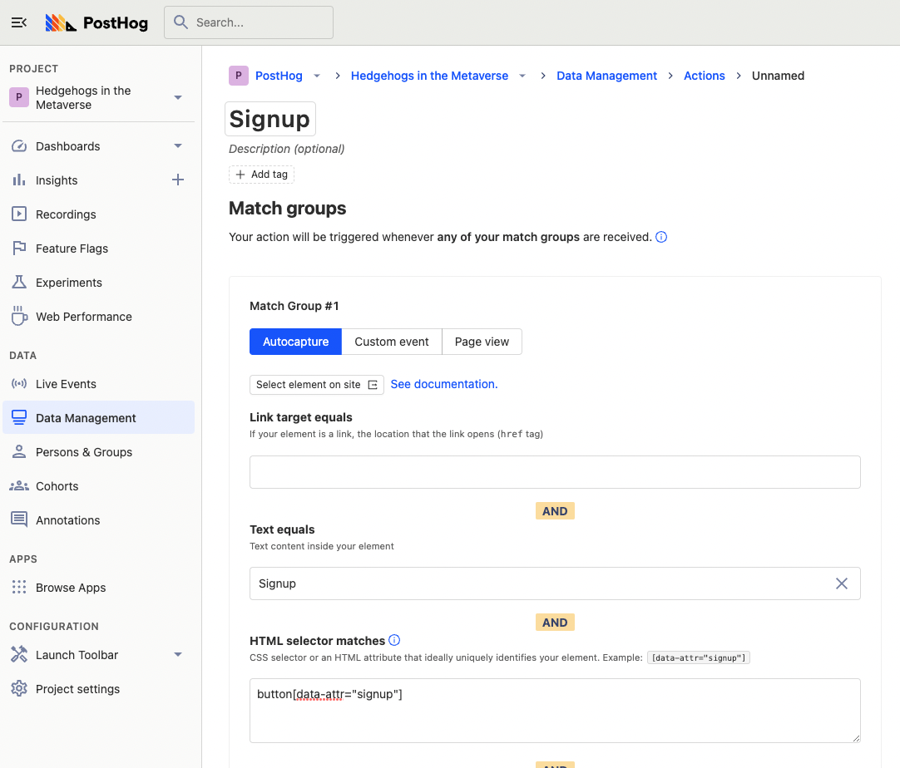
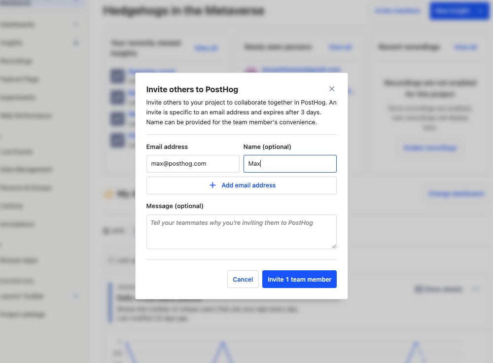
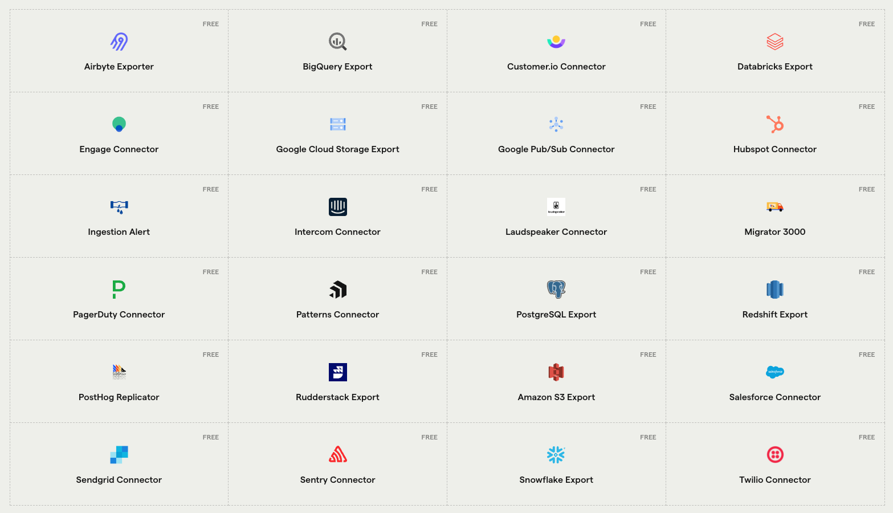
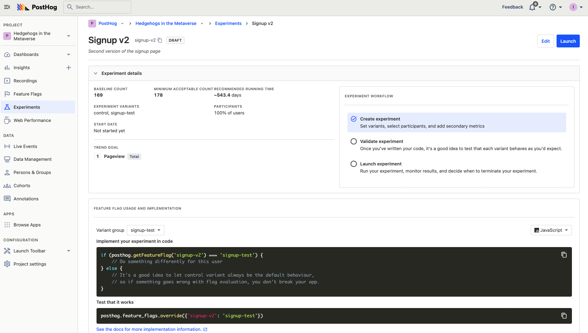

You created a PostHog account and installed it on your site, but what’s next? PostHog has many tools for helping you build better products, but if you don’t know where to start, the options can be overwhelming. This tutorial goes over the ABCs of what to do next after signing up and installing PostHog (we are assuming you’ve done both).

## All the events captured

If you installed PostHog through our [snippet](/docs/integrate#snippet) or [`posthog-js`](/docs/integrate/client/js) library, you’ll be autocapturing events. You product will send pageviews, button clicks, inputs, and more to PostHog. You’ll also have access to session recordings by turning them in “project settings” under "recordings.”

If you are using [another library](/docs/integrate#libraries) or the [API](/docs/api), you’ll need to implement event capture yourself. Luckily, our libraries make this easy, just a single call. Event capture calls look like this:

<MultiLanguage>

```js
posthog.capture(
  'movie played', 
  { 
    movieId: 'Return of the Hedgehogs', 
    category: 'thriller' 
  }
);
```

```php
PostHog::capture(array(
  'distinctId' => 'ian@posthog.com',
  'event' => 'movie played',
  'properties' => array(
    'movieId' => 'Return of the Hedgehogs',
    'category' => 'romcom'
  )
));
```

```ruby
posthog.capture({
  distinct_id: 'ian@posthog.com',
  event: 'movie played',
  properties: {
    movie_id: 'Return of the Hedgehogs',
    category: 'thriller'
  }
})
```

```node
client.capture({
  distinctId: 'ian@posthog.com',
  event: 'movie played',
  properties: {
      movieId: 'Return of the Hedgehogs',
      category: 'thriller',
  },
})
```

```python
posthog.capture(
  'ian@posthog.com', 
  'movie played', 
  {
    'movie_id': 'Return of the Hedgehogs',
    'category': 'thriller'
  }
)
```

```go
client.Enqueue(posthog.Capture{
  DistinctId: "ian@posthog.com",
  Event:      "movie played",
  Properties: posthog.NewProperties().
    Set("movieId", "Return of the Hedgehogs").
    Set("category", "thriller"),
})
```

</MultiLanguage>

To figure out where to capture events, think about the areas that have the biggest impact on the success of your product. We provide some ideas in “[finding your North Star metric and why it matters](/blog/north-star-metrics).” Some recommendations for areas you should focus on capturing:

- Signup
- Subscription
- Core features
- New features
- Marketing website

Autocapture covers some of these already. In this case, you can create actions (a combination of one or more events) to better represent user behavior. You can create actions in the “data management” section of the sidebar or interactively using the toolbar (click “launch toolbar” on the sidebar).



Be sure to add properties to your events to better capture the variables related to the events such as the value, type, version, or something else. For example, you might want to know what version of the product someone is using or if they are a customer or not. Properties can help you here, and you can set them for users as well. 

Finally, you may also want to connect to external services like [Stripe](/tutorials/stripe-payment-data) or [HubSpot](/apps/hubspot-connector) to get data. You can do that using [apps](/apps). To install an app, search for it in “browse apps,” then configure and activate it.

## Building a dashboard

Once you’ve got events flowing in, you’ll want to use that data to better understand your product. Instead of creating insights one at a time, you should think about creating a dashboard of multiple insights. Keep in mind what data you are capturing when you do this.

Some recommendations include:

- Key product analytics: usage trends, feature conversion, daily/weekly active users, retention
- Website traffic: overall traffic, top-performing pages, traffic breakdowns, sources
- AARRR: signup trends, usage trends, customer retention, revenue growth trends, attribution table
- Company Scorecard: key metric trends, signups, success rate trends, conversion funnels, revenue

> For both product analytics and website traffic, you can use templates to shortcut their creation. When creating a dashboard, select either option from the “template” dropdown.


Creating a dashboard will give you an understanding of the different types of insights you can create, from trends to retention. It will also help you refine the events you capture to better match what you want in your dashboard.

## Collaborating with your team

Now that you’ve done the work on getting PostHog set up with data and dashboards, your teammates can benefit from all your hard work. You can invite teammates easily by going to your instance homepage and clicking the invite button and adding their email. This will add them to your organization with access to all your projects.



To make sure they don’t mess up all your hard work, you can change their access levels in your organization settings. Setting them to “member” will prevent them from deleting or changing the settings in your project or instances. You can also set up projects you don’t want others to access as private in the project settings. 

When working with others, you likely will want to [filter them out](/tutorials/filter-internal-users) of the events. To do this, go to ”project settings”, scroll down to “filter out internal and test users”  and add filters such as host does not include local development addresses and email does not include your company’s domain.

## Data where you want it

Once everyone’s onboard with PostHog, you want the data to be where you all can see it. You want events and dashboards top of mind to help you improve your product. To do this, you can setup webhooks and subscriptions to your data and dashboards. 

If there are key events or actions you want to track, such as a potential customer visiting your pricing page, you can have it trigger a webhook. This requires setting up the webhook in the service of your choice (like [Slack](/docs/integrate/webhooks/slack), [Teams](/docs/integrate/webhooks/microsoft-teams), [Zapier](/tutorials/how-to-connect-posthog-and-notion-with-zapier), or [Discord](/docs/integrate/webhooks/discord)). You can then add the webhook to your PostHog instance in “project settings” under “webhook integration.” Finally, go to data management, create or select an action, then enable “post to webhook when this action is triggered.”


You can also subscribe to dashboards in Slack or via email. Just go to your dashboard, click the three dots to the left of share, click “subscribe,” and “new subscription.” If you want to send dashboards to Slack, you’ll need to configure our [Slack integration](/docs/integrate/third-party/slack). If you want dashboards by email, just fill in the details like the name, email, and recurrence, then click “create subscription.” 

Finally, if you want your data backed up or sent to an external service like [BigQuery](/apps/bigquery-export), [S3](/apps/s3-export), [Snowflake](/apps/snowflake-export), or many more, you can use one of our many [“data-out” apps](/apps). Just go to “browse apps,” search for the one you want, configure it, and start sending the data to the other places you want it.



## Experiment to improve your product

Once you have some data, and you’ve had a chance to gain some insights from it, it’s time to start using those insights to improve your product. A great way to do this is with experiments.

Experiments is a feature that helps you test if changes improve your product in the ways you care about.

To create an experiment, go to “experiments,” click “new experiment,” fill in the details, set up the variants you’d like to test, who’d you like to test it on, and the metric you’re trying to improve. When you click save, PostHog will create feature flags for your experiment that you can add to your code. Once you’ve implemented the feature flags, click launch and PostHog will track the experiment’s progress.



Throughout the time the experiment runs, PostHog will give you details of the results. We automatically do correlation analysis to tell if the changes are making a difference. Hopefully, by the end of your experiment, your changes are a success. The use of feature flags makes it easy to roll out to everyone. 

## Further reading

- Capture more events by [deploying a reverse proxy to PostHog Cloud](/docs/integrate/proxy)
- [Complete guide to event tracking](/tutorials/event-tracking-guide)
- [Calculating average session duration, time on site, and other session-based metrics](/tutorials/session-metrics)